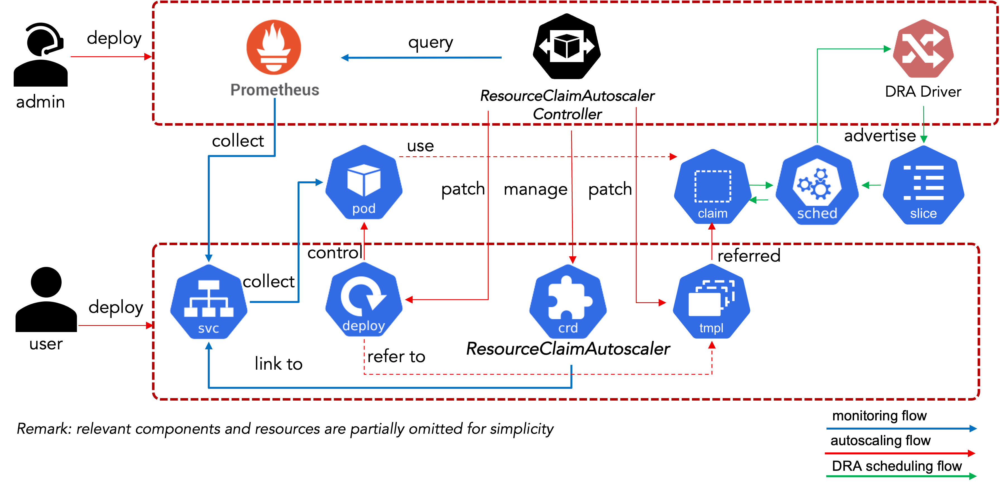

# Kubernetes ResourceClaim Autoscaler for LLM Inference Serving

This controller controls the ResourceClaimAutoscaler (RCA) CRD to scale the Dynamic Resource Allocation (DRA)'s resource claim of LLM inference services on Kubernetes according to their metrics.

## Key Features

### 🔍 Auto-Detection

- **Service-Based Discovery**: Automatically detects workload owners (Deployment, StatefulSet) from Service endpoints
- **Prometheus Integration**: Collects metrics directly from Prometheus for traffic analysis and tuning

### 📊 Resource Requirement Estimation

- **Hint-based Estimation**: Estimate resource requirements based on given model and GPU spec and hint.
- **Multi-GPU Support**: Accounts for multiple GPUs
- **KV Cache Modeling**: Accounts for cache hit rates and speedup factors
- **Prefill/Decode Phases**: Separate modeling of prompt processing and token generation

### 🎯 Auto-Scaling

- **Queue Theory-Based Prediction**: Uses M/M/c queueing models with Erlang C formulas for latency estimation
- **Resource Claim Life cycle Management**: Manages patching scaling ResourceClaim
- **Lookback Windows**: Prevents thrashing with configurable lookback windows
- **Rate-Limited Scaling**: Gradual scale-up/down with percentage or pod-based policies
- **Graceful Transitions**: Configurable grace periods for smooth resource changes

## Architecture Overview



The system requires administrators to install a monitoring stack (Prometheus) and DRA driver alongside this autoscaler. Three workflows cooperate to provide automated resource scaling:

### 1. Monitoring Workflow

Admin configures monitoring parameters (Prometheus endpoint, queries) via `RCAControllerConfig` CRD. When user creates `ResourceClaimAutoscaler`, the controller discovers the workload owner from the target Service.

### 2. Scaling Workflow

**Optimization**: The optimizer uses queue-theory models (M/M/c with Erlang C formulas) to calculate optimal resource requirements based on collected metrics (arrival rate, latency, etc.).

For more details, see [Resource Optimization Concept](docs/concept/resource_optimization.md).

**Scaling**: The controller automatically detects the workload owner (Deployment, StatefulSet) and generates a new `ResourceClaimTemplate` with updated resource requests. It then patches the workload owner with the new template and replica count. Due to current DRA limitations (no in-place scaling), pods must be recreated with new ResourceClaims. The controller watches `ResourceClaim` events to update status and cleanup old templates.

For more details, see [Controller Reconcile Workflows](docs/concept/controller-reconcile-workflows.md).

### 3. DRA Scheduling Workflow

After the workload is patched with the new `ResourceClaimTemplate`, Kubernetes recreates pods with new resource claims. The DRA driver schedules these pods to nodes with available resources.

## Getting Started

### To Deploy on the cluster

**Build and push your image to the location specified by `IMG`:**

```sh
make docker-build docker-push IMG=<some-registry>/rca-controller:tag
```

**NOTE:** This image ought to be published in the personal registry you specified.
And it is required to have access to pull the image from the working environment.
Make sure you have the proper permission to the registry if the above commands don’t work.

**Install the CRDs into the cluster:**

```sh
make install
```

**Deploy the Manager to the cluster with the image specified by `IMG`:**

```sh
make deploy IMG=<some-registry>/rca-controller:tag
```

> **NOTE**: If you encounter RBAC errors, you may need to grant yourself cluster-admin
privileges or be logged in as admin.

**Create instances of your solution**
You can apply the samples (examples) from the config/sample:

```sh
kubectl apply -k config/samples/
```

>**NOTE**: Ensure that the samples has default values to test it out.

### To Uninstall

**Delete the instances (CRs) from the cluster:**

```sh
kubectl delete -k config/samples/
```

**Delete the APIs(CRDs) from the cluster:**

```sh
make uninstall
```

**UnDeploy the controller from the cluster:**

```sh
make undeploy
```

## Project Distribution

Following the options to release and provide this solution to the users.

### By providing a bundle with all YAML files

1. Build the installer for the image built and published in the registry:

```sh
make build-installer IMG=<some-registry>/rca-controller:tag
```

**NOTE:** The makefile target mentioned above generates an 'install.yaml'
file in the dist directory. This file contains all the resources built
with Kustomize, which are necessary to install this project without its
dependencies.

2. Using the installer

Users can just run 'kubectl apply -f <URL for YAML BUNDLE>' to install
the project, i.e.:

```sh
kubectl apply -f https://raw.githubusercontent.com/<org>/rca-controller/<tag or branch>/dist/install.yaml
```

### By providing a Helm Chart

1. Build the chart using the optional helm plugin

```sh
operator-sdk edit --plugins=helm/v1-alpha
```

2. See that a chart was generated under 'dist/chart', and users
can obtain this solution from there.

**NOTE:** If you change the project, you need to update the Helm Chart
using the same command above to sync the latest changes. Furthermore,
if you create webhooks, you need to use the above command with
the '--force' flag and manually ensure that any custom configuration
previously added to 'dist/chart/values.yaml' or 'dist/chart/manager/manager.yaml'
is manually re-applied afterwards.

## Development

### Code Style Guide

Please read and follow our [Code Style Guide](docs/code-style.md) before contributing. Key points:

- **Testing**: Use Ginkgo/Gomega for all tests
- **Quality**: Always run `make lint` and `make test` before committing
- **Coverage**: Maintain >70% test coverage for new code
- **Documentation**: Add godoc comments for all exported items

### Running Tests

```sh
# Run all tests with coverage
make test

# Run linter
make lint

# Run both
make test lint
```

### Pre-Commit Checklist

Before committing code:

- [ ] `make lint` passes with 0 issues
- [ ] `make test` passes with all tests green
- [ ] `make api-docs` regenerates API documentation in `docs/api` if API changed
- [ ] `make manifests` regenerates CRDs if API changed

## Repository links

- [Contributing](CONTRIBUTING.md)
- [License](LICENSE)
