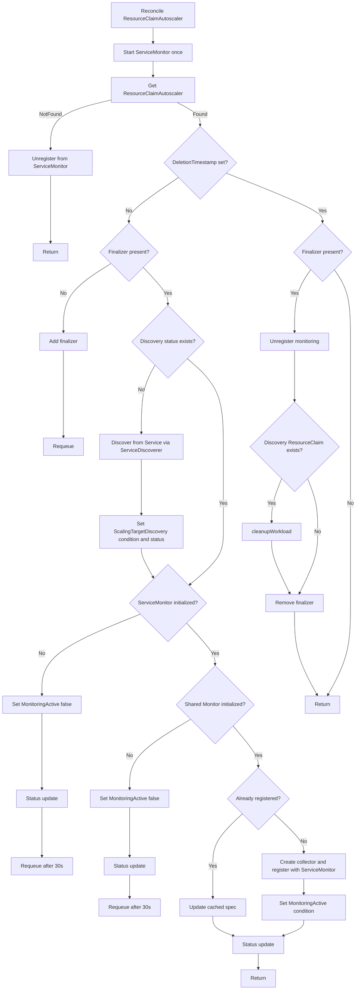
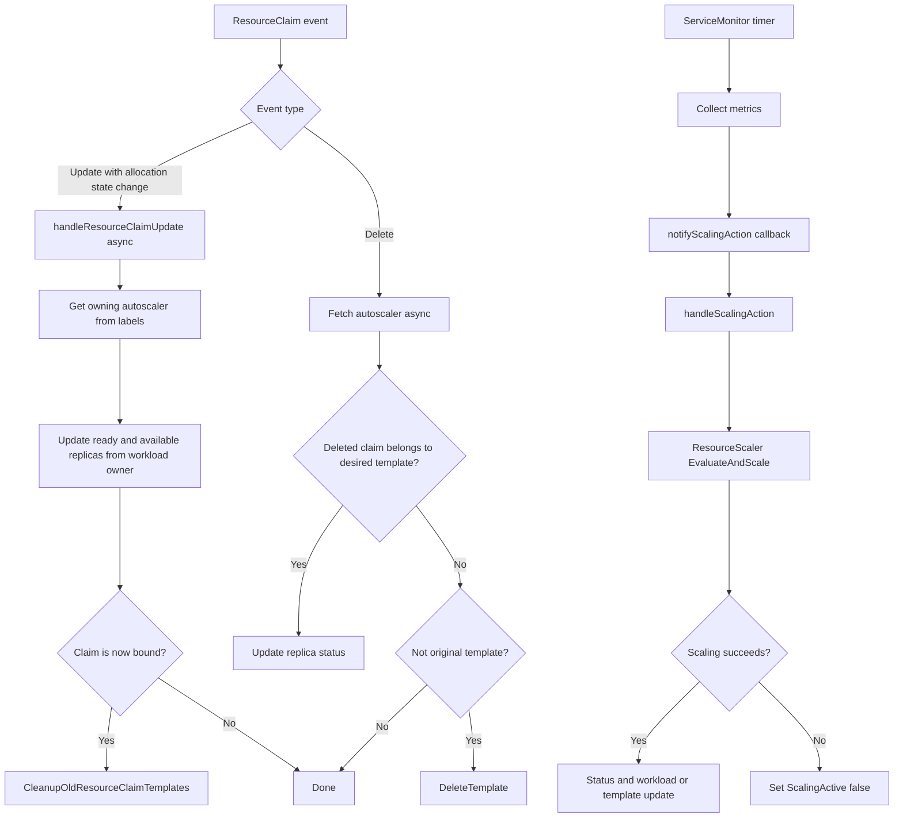
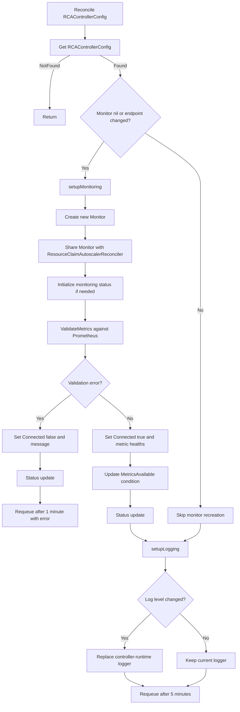

# Controller Reconcile Workflows

This document summarizes the reconcile workflow of each controller in this repository and includes Mermaid graphs for the main flows.

- [`RCAControllerConfigReconciler`](#resourceclaimautoscaler-reconciler) is the **operator configuration controller**.
- [`ResourceClaimAutoscalerReconciler`](#rcacontrollerconfig-reconciler) is the **resource lifecycle and monitoring registration controller**.
- Actual scale execution is mostly **event-driven from ServiceMonitor callbacks**, not from the main autoscaler reconcile loop itself.
- `ResourceClaim` watch handlers close the lifecycle loop by cleaning up generated templates and refreshing replica status after claim allocation/deletion.

## ResourceClaimAutoscaler Reconciler

This controller manages the lifecycle of a `ResourceClaimAutoscaler` custom resource.

### Primary reconcile workflow

1. Start reconcile and ensure the shared `ServiceMonitor` is started once.
2. Fetch the `ResourceClaimAutoscaler`.
3. If the CR is gone:
   - unregister it from `ServiceMonitor`
   - stop
4. Handle finalizer:
   - if not deleting and finalizer is missing, add it and requeue
   - if deleting, unregister monitoring, restore workload/template/replicas, remove finalizer, stop
5. If discovery has not been done yet:
   - resolve target service namespace
   - call `discovery.NewServiceDiscoverer(...).DiscoverFromService(...)`
   - write discovery result into status:
     - workload owner
     - original `ResourceClaimTemplate`
   - set `ScalingTargetDiscovery` condition
6. Validate monitoring prerequisites:
   - if `ServiceMonitor` is nil, set `MonitoringActive=False`, update status, requeue after 30s
   - if shared `Monitor` is nil, set `MonitoringActive=False`, update status, requeue after 30s
7. If already registered in `ServiceMonitor`:
   - update cached spec only
   - skip new registration
8. Otherwise register a new monitoring event:
   - create `AutoscalerMetricsCollector`
   - compute effective behavior defaults
   - register with `ServiceMonitor`
   - set `MonitoringActive` condition based on success/failure
9. Update status and return success.

### Important subflows

#### A. Delete / finalizer cleanup flow

When the `ResourceClaimAutoscaler` is being deleted:

- unregister monitoring
- if discovery info exists, call `cleanupWorkload(...)`
- `cleanupWorkload(...)`:
  - fetch owner workload (`Deployment` or `StatefulSet`)
  - reset replicas to `minReplicas` from constraints, default `1`
  - restore pod template `ResourceClaimTemplateName` back to discovered original template
  - update workload once
- remove finalizer
- stop reconciliation

#### B. ResourceClaim watch-driven side effects

This controller also watches `resource.k8s.io/ResourceClaim`.

Two important cases trigger extra actions:

1. **Update event** when allocation state changes
   - async call to `handleResourceClaimUpdate(...)`
   - fetch owning autoscaler from labels
   - refresh ready/available replicas from owner workload
   - if claim became bound, cleanup old unused generated templates

2. **Delete event**
   - async fetch autoscaler from labels
   - if deleted claim belongs to current desired template, refresh replica status
   - otherwise, if it is an old generated template and not the original, delete unused template
   - also triggers normal reconcile

#### C. Monitoring callback → scaling flow

`ServiceMonitor` invokes `handleScalingAction(...)` asynchronously.

That flow is:

1. create `scaler.ResourceScaler`
2. call `EvaluateAndScale(...)` with already-collected metrics
3. scaler:
   - computes arrival rate and latency offsets
   - handles zero-traffic special case using minimum constraints
   - applies default target latencies if unspecified
   - runs queue-theory optimizer to find desired configuration
   - compares desired config with current config/template
   - enforces grace period and single-step scaling limit
   - updates autoscaler status
   - applies either:
     - replica-only update, or
     - resource-template patch + workload patch
4. if scaling fails, controller retries status update and sets:
   - `ScalingActive=False`
   - reason `ScalingFailed`

### ResourceClaimAutoscaler Reconcile flow

### Watch + scaling side flows

### Key implementation notes

- Monitoring registration is intentionally persistent; later reconciles usually only refresh the cached spec.
- The real scaling logic does **not** happen directly inside `Reconcile`; it happens in the `ServiceMonitor` callback path.
- The controller uses the discovered original template as the stable rollback point.
- Resource-template cleanup is delayed until generated `ResourceClaim`s become bound or deleted, reducing premature deletion risk.

---

## RCAControllerConfig Reconciler

This controller manages operator-wide configuration, especially:

- Prometheus monitoring endpoint and queries
- shared `Monitor` initialization
- runtime log level changes

It acts as the provider of the shared monitoring backend used by `ResourceClaimAutoscalerReconciler`.

**Primary reconcile workflow**

1. Start reconcile and fetch the `RCAControllerConfig`.
2. If the config object is missing:
   - log and stop
3. Log the discovered config endpoint and generation.
4. If shared monitor is not initialized, or monitoring endpoint changed:
   - call `setupMonitoring(...)`
   - create a new `monitor.Monitor`
   - share it with `ResourceClaimAutoscalerReconciler` via `SetMonitor(...)`
   - initialize `status.monitoringStatus` if needed
   - validate configured/default metrics by executing Prometheus queries
   - update `status.monitoringStatus` and `MetricsAvailable` condition
   - on setup error, requeue after 1 minute with error
5. Run `setupLogging(...)`
   - determine desired log level from config or default `INFO`
   - if changed, replace controller-runtime logger with a new zap logger
6. Requeue after 5 minutes for periodic revalidation.

### RCAControllerConfig Reconcile flow

