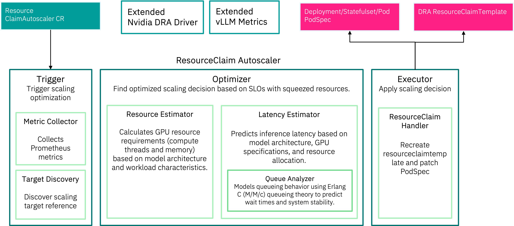
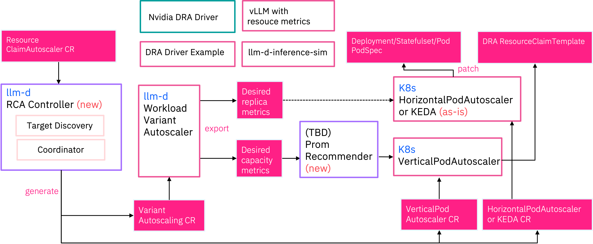

# Proposals for Migrating this Project to Upstreams

This project includes end-to-end resource claim autoscaling systems for LLM inference workloads. However, for long-term planning, we are planning to migrate the initiatives inside this project to applicable upstream projects. This document records the proposals for the migration.

## Overview

The ResourceClaim Autoscaler (RCA) Controller provides automated scaling of Dynamic Resource Allocation (DRA) resources for LLM inference services. The system uses queue-theory-based optimization to determine optimal resource configurations and manages the lifecycle of ResourceClaims to achieve target latency SLOs while minimizing costs.

## Current Architecture and Target Upstreams

The below figure shows the current architecture of the project. Details of the components are described in the [concept](../concept) documentation. We are targeting to propose an integration of the **Optimizer** to [llm-d/llm-d-workload-variant-autoscaler](https://github.com/llm-d/llm-d-workload-variant-autoscaler) and the **Executor** to [kubernetes/autoscaler](https://github.com/kubernetes/autoscaler).

### Upstream Integration Proposals

- [Proposal(s) to llm-d/llm-d-workload-variant-autoscaler](./llm-d/llm-d-workload-variant-autoscaler/) - [Unavailable]
- [Proposal(s) to kubernetes/autoscaler](./kubernetes/autoscaler/) - [Initial Draft Available]

To complete the picture, remaining components and modifications are planned as below.

### New Projects

- [llm-d/rca-controller](./llm-d/rca-controller/) - Standalone ResourceClaim autoscaler controller - [Unavailable]
- [tbd/prometheus-vpa-recommender](./tbd/prometheus-vpa-recommender/) - Prometheus-based VPA recommender - [Initial Draft Available]

### Enhancements to Existing Projects

- [kubernetes-sigs/dra-example-driver](https://github.com/kubernetes-sigs/dra-example-driver): Add consumable capacity feature support [PR#236](https://github.com/kubernetes-sigs/dra-example-driver/pull/236)
- [llm-d/llm-d-inference-sim](https://github.com/llm-d/llm-d-inference-sim): Add resource consumption estimation and metrics - [Unavailable]
- [vllm-project/vllm](https://github.com/vllm-project/vllm): Add resource consumption metrics - [Unavailable]

## Next Phase: In-Place Resizing Feature

The current resizing mechanism requires stopping the pod and starting a new pod with the new resource request. This is a cold-start problem, which means that the pod needs to be restarted and the inference service needs to be re-initialized. This can be a significant overhead, especially for large models. To address this, the next phase is to implement a warm-start mechanism, which will allow the pod to be resized without restarting the inference service.

To achieve this, we are planning to propose enhancements to:

- [Kubernetes DRA](./kubernetes/inplace-claim-resize/) - In-place ResourceClaim resizing support
- [vLLM](./vllm/inplace-resize/) - Dynamic resizing and fast model reloading

## Roadmap

### Phase 1: Planning

> June 2026, 1 Months

**Goal**: Plan integraion strategy

- [ ] Conduct thorough analysis of existing components
- [ ] Identify integration points between components
- [ ] Evaluate compatibility and potential conflicts
- [ ] Define clear integration requirements
- [ ] Create detailed integration plan
- [ ] Identify potential risks and mitigation strategies
- [ ] Reach out to the community for feedback

**Deliverables**:

- Detailed integration plan
- List of required changes in each component
- Risk assessment and mitigation strategies
- Timeline and resource allocation

### Phase 2: Core Integration

> June-July 2026, 2 Months

**Goal**: Establish foundation for resource claim autoscaler

- [ ] Implement DRA support in Kubernetes VerticalPodAutoscaler
- [ ] Implement vertical scaling support in llm-d autoscaler
  - [ ] Add desired device resource capacity metrics
  - [ ] Implement QueuingModelWithResourceUsageAnalyzer
  - [ ] Implement MultidimensionalOptimizer

**Deliverables**:

- Working prototype of integrated autoscaler
- Comprehensive test suite
- Documentation of integration points
- Performance benchmarks

### Phase 3: Research and Refinement

> August-October 2026, 3 Months

**Goal**: Refine analyzing and optimization methods to improve performance results

- [ ] Research and Investigate advanced analysis and optimization techniques
- [ ] Implement advanced analysis and optimization methods
- [ ] Validate performance improvements
- [ ] Eliminate cold-start overhead during scaling
  - [ ] Implement warm-start model reloading
  - [ ] Implement Kubernetes DRA in-place resize API

**Deliverables**:

- Enhanced analysis and optimization methods
- Inplace resize PoC
- Performance comparison with baseline
- Documentation of improvements

### Phase 4: Upstream Demonstration and Donation

> H1 2027, 9 Months

**Goal**: Demonstrate and migrate components to upstream projects

- [ ] Submit optimizer integration to llm-d/llm-d-workload-variant-autoscaler
- [ ] Propose ResourceClaim autoscaler to kubernetes/autoscaler
- [ ] Contribute DRA enhancements to kubernetes-sigs/dra-example-driver
- [ ] Submit metrics and estimation to llm-d/llm-d-inference-sim
- [ ] Contribute resource metrics to vllm-project/vllm

**Deliverables**:

- KEP (Kubernetes Enhancement Proposal) for DRA in-place resize
- Enhancement Proposal (EP) for autoscaler
- vLLM PR for dynamic resource resizing support
- Deprecation plan for standalone controller
- Migration documentation for users
- Community adoption metrics

### Phase 5: Production Rollout (Months 13-18)

> H2 2027, 6 Months

**Goal**: Achieve production stability and adoption

- [ ] Deploy to production clusters with monitoring
- [ ] Collect performance metrics and user feedback
- [ ] Iterate on optimization algorithms based on real workloads
- [ ] Develop best practices and tuning guides
- [ ] Create case studies and success stories

**Deliverables**:

- Performance optimization reports
- Best practices documentation
- User testimonials and case studies

## Contributing

We welcome contributions to any of the proposals in this directory. Please see our [Contributing Guide](../../CONTRIBUTING.md) for details on how to get involved.

For questions or discussions about specific proposals, please open an issue in the relevant upstream repository or in this project's issue tracker.
