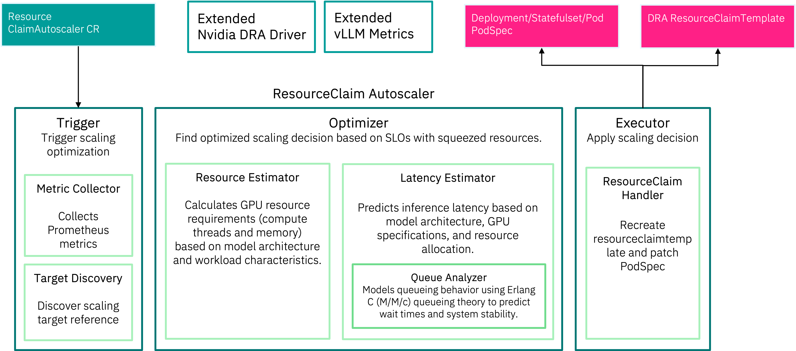
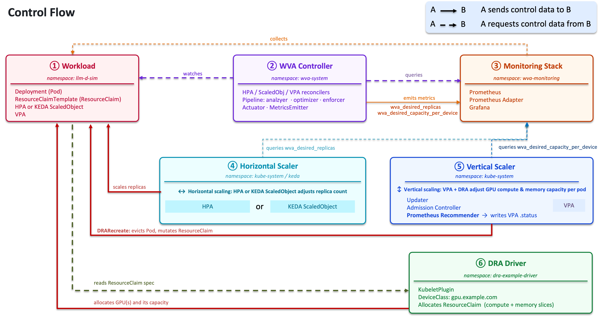

# Proposals for Migrating this Project to Upstreams

> This project includes end-to-end resource claim autoscaling systems for LLM inference workloads. However, for long-term planning, we are planning to migrate the initiatives inside this project to applicable upstream projects. This document records the proposals for the migration.

## Table of Contents

- [Overview](#overview)
  - [Multi-Dimensional Scaling Design Goals](#multi-dimensional-scaling-design-goals)
  - [Technical Challenges](#technical-challenges)
- [Current Architecture and Target Upstreams](#current-architecture-and-target-upstreams)
  - [Upstream Integration Proposals](#upstream-integration-proposals)
  - [New Projects](#new-projects)
  - [Enhancements to Existing Projects](#enhancements-to-existing-projects)
- [Next Phase: In-Place Resizing Feature](#next-phase-in-place-resizing-feature)
- [Roadmap](#roadmap)
  - [Phase 1: Planning](#phase-1-planning)
  - [Phase 2: Core Integration](#phase-2-core-integration)
  - [Phase 3: Research and Refinement](#phase-3-research-and-refinement)
  - [Phase 4: Upstream Demonstration and Donation](#phase-4-upstream-demonstration-and-donation)
  - [Phase 5: Production Rollout](#phase-5-production-rollout-months-13-18)
- [Contributing](#contributing)

## Overview

LLM inference workloads on GPU clusters face a fundamental tension: hardware is expensive, demand is bursty, and neither purely horizontal scaling (adding pods) nor static resource allocation alone can efficiently balance latency SLOs with cost. This project addresses that tension through **multi-dimensional scaling** — jointly optimising GPU resource allocations (VRAM, compute slices) and replica count at runtime, without requiring pre-supplied model metadata or hardware-specific performance profiles.

The ResourceClaim Autoscaler (RCA) Controller implements this via queue-theory-based optimization over Dynamic Resource Allocation (DRA) resources, managing the full lifecycle of ResourceClaims to meet latency targets while minimizing hardware waste. The proposals in this document cover how these capabilities will be migrated to and integrated with upstream projects, and what enhancements are needed across the Kubernetes, llm-d, and vLLM ecosystems to realize the multi-dimensional scaling goals and overcome the technical challenges described below.

### Multi-Dimensional Scaling Design Goals

| Goal | Description |
| --- | --- |
| **Maximize Hardware Yield** | Squeeze maximum utilization out of expensive physical hardware before triggering costly node-level scale-ups. |
| **Zero-Downtime Adaptability** | Adjust GPU resource allocations (VRAM, compute cores) on the fly without restarting pods or interrupting long-running AI training jobs. |
| **Transparent Resource Delivery** | Abstract underlying hardware configurations (like MIG partitions or time-slicing) so developers can request fractional or dynamic GPU resources via standard YAML specs. |
| **Granular Cost Efficiency** | Enable micro-scaling of resources to minimize waste during idle or low-demand periods (e.g., downsizing a GPU slice when an LLM inference service is quiet). |
| **Metadata-Free Heterogeneous Cluster Support** | Enable accurate multi-dimensional scaling decisions across mixed GPU architectures without requiring pre-supplied model metadata or hardware-specific performance profiles, relying instead on runtime observation and adaptive estimation. |

### Technical Challenges

| Challenge | Description |
| --- | --- |
| **HPA Alignment & Race Conditions** | Prevent scaling conflicts where HPA tries to scale out (add pods) while multi-dimensional scaling mechanisms try to scale up (add VRAM/compute), resulting in resource thrashing and instability. |
| **Monolithic Memory Boundaries** | Unlike CPU or RAM, physical GPU memory (VRAM) cannot be easily hot-plugged, dynamically shared, or paged to disk at the hypervisor layer without significant performance penalties. |
| **Dynamic Device Re-binding** | Overcoming the Kubernetes device management framework's limitation, which traditionally binds GPU devices to containers only at initial container creation time. |
| **Extended Bootstrapping Latency** | Initializing drivers, CUDA contexts, and reloading massive AI models into VRAM during a multi-dimensional resizing event can introduce severe application lag. |
| **Hardware-Enforced Slicing Limits** | Managing rigid physical partitioning frameworks (like NVIDIA MIG), which require static node-level configuration changes and cannot seamlessly resize a partition on a running GPU. |
| **Opaque Per-Process Resource Utilization** | GPU drivers and runtime environments often expose only aggregate device-level metrics, making it difficult to attribute actual VRAM and compute consumption to individual inference processes or model replicas. |
| **Incomplete Model & Performance Profiles on Heterogeneous GPUs** | Model metadata (e.g., memory footprint, compute intensity) and performance profiles (throughput, latency curves) are frequently unavailable or untransferred across different GPU architectures, preventing accurate multi-dimensional scaling decisions in heterogeneous clusters. |

## Current Architecture and Target Upstreams

The below figure shows the current architecture of the project. Details of the components are described in the [concept](../concept) documentation. We are targeting to propose an integration of the **Optimizer** to [llm-d/llm-d-workload-variant-autoscaler](https://github.com/llm-d/llm-d-workload-variant-autoscaler) and the **Executor** to [kubernetes/autoscaler](https://github.com/kubernetes/autoscaler).

### Upstream Integration

We have proposed a new feature to two projects those are (i) Workload Variant Autoscaler under llm-d organization and (ii) Vertical Pod Autoscaler under Kubernetes Autoscaler. The overview of control flow is as below, consisting of 6 operational namespaces.

For more details of each proposal, check

- [Proposal(s) to llm-d/llm-d-workload-variant-autoscaler](./llm-d/llm-d-workload-variant-autoscaler/)
- [Proposal(s) to kubernetes/autoscaler](./kubernetes/autoscaler/)

In addition to the core integration proposal, we also introduce a new project called [prometheus-vpa-recommender](./tbd/prometheus-vpa-recommender/) - Prometheus-based VPA recommender to bind the `llm-d-workload-variant-autoscaler` with the `VerticalPodAutoscaler` in `kubernetes/autoscaler`.

Other upstream contributions related to this project:

- [kubernetes-sigs/dra-example-driver](https://github.com/kubernetes-sigs/dra-example-driver): Add consumable capacity feature support [PR#236](https://github.com/kubernetes-sigs/dra-example-driver/pull/236) - **Merged**

## Next Phase: In-Place Resizing Feature

The current resizing mechanism requires stopping the pod and starting a new pod with the new resource request. This is a cold-start problem, which means that the pod needs to be restarted and the inference service needs to be re-initialized. This can be a significant overhead, especially for large models. To address this, the next phase is to implement a warm-start mechanism, which will allow the pod to be resized without restarting the inference service.

To achieve this, we are planning to propose enhancements to:

- [Kubernetes DRA](./kubernetes/inplace-claim-resize/) - In-place ResourceClaim resizing support
- [vLLM](./vllm/inplace-resize/) - Dynamic resizing and fast model reloading

## Roadmap

### Phase 1: Planning

> June 2026, 1 Months

**Goal**: Plan integraion strategy

- [x] Conduct thorough analysis of existing components
- [x] Identify integration points between components
- [x] Evaluate compatibility and potential conflicts
- [x] Define clear integration requirements
- [x] Create detailed integration plan
- [x] Identify potential risks and mitigation strategies
- [x] Reach out to the community for feedback

**Deliverables**:

- Detailed integration plan
- List of required changes in each component
- Risk assessment and mitigation strategies
- Timeline and resource allocation

### Phase 2: Core Integration

> June-July 2026, 2 Months

**Goal**: Establish foundation for resource claim autoscaler

- [x] Implement DRA support in Kubernetes VerticalPodAutoscaler
- [x] Implement vertical scaling support in llm-d autoscaler
  - [x] Add desired device resource capacity metrics
  - [x] Implement QueuingModelWithResourceUsageAnalyzer
  - [x] Implement MultidimensionalOptimizer

**Deliverables**:

- Working prototype of integrated autoscaler
- Comprehensive test suite
- Documentation of integration points

### Phase 3: Research and Refinement

> August-October 2026, 3 Months

**Goal**: Refine analyzing and optimization methods to improve performance results

- [ ] Research and Investigate advanced analysis and optimization techniques
- [ ] Implement advanced analysis and optimization methods
- [ ] Validate performance improvements
- [ ] Eliminate cold-start overhead during scaling
  - [ ] Implement warm-start model reloading
  - [ ] Implement Kubernetes DRA in-place resize API

**Deliverables**:

- Enhanced analysis and optimization methods
- Inplace resize PoC
- Performance comparison with baseline
- Documentation of improvements

### Phase 4: Upstream Demonstration and Donation

> H1 2027, 9 Months

**Goal**: Demonstrate and migrate components to upstream projects

- [ ] Submit optimizer integration to llm-d/llm-d-workload-variant-autoscaler
- [ ] Propose ResourceClaim autoscaler to kubernetes/autoscaler
- [ ] Contribute DRA enhancements to kubernetes-sigs/dra-example-driver
- [ ] Submit metrics and estimation to llm-d/llm-d-inference-sim
- [ ] Contribute resource metrics to vllm-project/vllm

**Deliverables**:

- KEP (Kubernetes Enhancement Proposal) for DRA in-place resize
- Enhancement Proposal (EP) for autoscaler
- vLLM PR for dynamic resource resizing support
- Deprecation plan for standalone controller
- Migration documentation for users
- Community adoption metrics

### Phase 5: Production Rollout (Months 13-18)

> H2 2027, 6 Months

**Goal**: Achieve production stability and adoption

- [ ] Deploy to production clusters with monitoring
- [ ] Collect performance metrics and user feedback
- [ ] Iterate on optimization algorithms based on real workloads
- [ ] Develop best practices and tuning guides
- [ ] Create case studies and success stories

**Deliverables**:

- Performance optimization reports
- Best practices documentation
- User testimonials and case studies

## Contributing

We welcome contributions to any of the proposals in this directory. Please see our [Contributing Guide](../../CONTRIBUTING.md) for details on how to get involved.

For questions or discussions about specific proposals, please open an issue in the relevant upstream repository or in this project's issue tracker.
